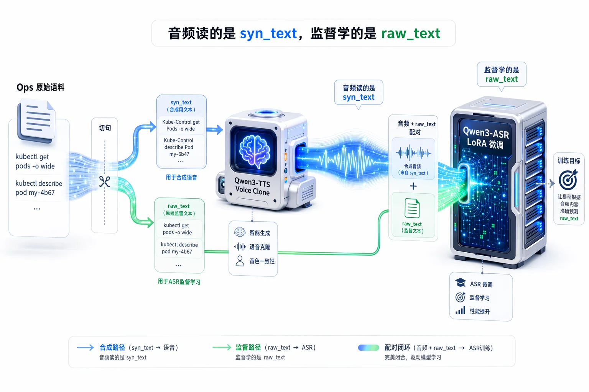
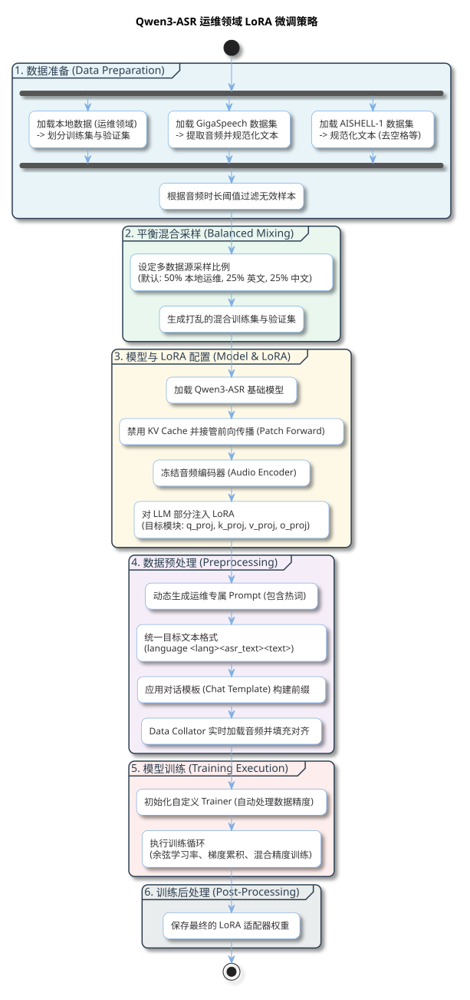

为了解决Chaterm移动端语音输入K8S命令识别的准确率，降低通用语音识别模型在运维场景中常因领域术语（如 kubectl、ConfigMap）的先验缺失而导致命令识别错误的概率。

本文基于 Qwen3-ASR 的领域适配合成约 3 万条运维语音数据，结合文本解耦与平衡重放策略进行 LoRA 微调，将运维领域 CER 从约 24% 降至约 6%，同时基本保持了模型的通用识别能力。

---

# 基于 Qwen3-ASR 的K8S语音指令识别增强：初探

很多工程师往往都碰到过类似的场景，当你赶着火车唱着歌拖着行李箱，正准备享受愉快的五一假期。

就在这时，那声工程师再熟悉不过、却最不想听到的报警提示音，穿透了人群——「 [P0 级报警] 核心交易服务响应超时！」

为了能让大家在各种场景下及时处理业务问题，Chaterm 使用 Qwen3-ASR 模型，打造 SRE 移动版 Claude Code。

为此，我们对 **Qwen3-ASR**（阿里最新开源的语音大模型，覆盖 1.7B 和 0.6B 两个规格）做了一次针对性适配，联合 **Qwen3-TTS** 构建合成数据，通过 **LoRA** 微调实现领域自适应。不是简单的模型迁移，而是**从数据构造到模型微调的一次初步探索**。

今天聊聊，我们怎么尝试让开源 ASR 模型从「普通话听力十级」，向「运维语境适配」迈出一步。

---

## 01 运维 ASR 的痛点：不是听不清，是「转不对」

### 1.1 为什么通用 ASR 在运维场景总是「翻车」？

普通语音识别最怕的不是噪音，而是 **「领域代沟」**。

当你说「kubectl」时，模型脑子里没有这个概念，只能强行匹配它认识的词：

| 你说的是         | 它听到的                              | 误差后果         |
| ---------------- | ------------------------------------- | ---------------- |
| `kubectl`        | 「cube control」「Q控制」「酷不控制」 | 直接不认识主命令 |
| `ConfigMap`      | 「config map」「config 地图」         | 资源类型识别失败 |
| `Liveness Probe` | 「liveness 扑肉布」「活着的探针」     | 健康检查配置错乱 |
| `yaml`           | 「yarn」「牙买」「亚_ml」             | 配置文件格式错误 |

**关键矛盾**：聊天场景允许「意思差不多」，但运维场景需要尽可能精确。这也是为什么传统"热词表 + 后处理"方案面对复杂的连读、口音、中英混杂和符号参数（如 `-n`、`/`）时，往往存在一定局限。

于是我们尝试：给 Qwen3-ASR 做一次「耳科手术」—— **LoRA 微调**。

---

## 02 巧妇难为无米之炊：没有数据？我们「造」数据！

### 2.1 真实运维语音数据太少了

想做模型微调，首先要解决「训练数据从哪来」。真实的运维语音数据既难获取，又涉及隐私。于是我们换了个思路：**利用 Qwen3-TTS 的 In-Context Learning (ICL) 语音克隆能力，让 AI 自己教自己**。

这就像让学霸先「朗读课文」录下来，再给学渣当听力教材。

**文本语料层面**，我们准备了约 8,000 条原始文本，来源对半分：50% 是通过 LLM 生成的 K8S/Linux 指令句子，50% 是从 OPS 领域电子书中提取的描述性语料。这两类文本混合使用，让训练数据既覆盖「命令式短句」，也覆盖「描述式长句」，希望提升模型的泛化边界。

**声学层面**，我们找了 **3 男 2 女**在普通安静房间+手机麦克风环境下录制了基础音色（Basic Voice），刻意保留了轻微的日常口音，以提升声学鲁棒性。为防止模型对特定音色-词汇组合过拟合，每个 Basic Voice 仅随机采样整体语料的 75% 进行合成。最终构造了约 **3 万条**合成语音数据。

### 2.2 最烧脑的一步：文本「双语」解耦系统

但直接拿运维文本去合成语音，TTS 会面临严重的 **G2P (字音转换) 崩溃**。它读不准 `kubectl`，也处理不好各种特殊符号。

为此，我们设计了一套**文本解耦架构**：

- **raw_text（监督标签）**：最终希望 ASR 输出的标准文本，即我们平时敲的命令。
- **syn_text（发音文本）**：专门喂给 TTS 的"暗语"，为了保证声学生成质量。

**硬核规范化工程规则：**
1. **发音强制映射**：将不可读术语转为稳定音素。比如 `kubectl` 映射为 `Kube-Control`，`mysql` 映射为 `My-Circle`。
2. **符号与数字口语化**：`-` 映射为 `杠`，`/` 映射为 `斜杠`。特别注意：**阿拉伯数字全部强制映射为中文大写**，以此避开 TTS 内置数字归一化不可控的问题。
3. **句尾声学保护**：这是一个踩坑得来的经验。我们发现由于 TTS 模型的感受野和静音截断机制，如果不加句尾符号，极易导致最后一个字发音含混或直接吞字。因此，**在所有 `syn_text` 结尾强制追加 `. `（空格+英文句号）**。

*Pipeline 示例：*
> **Input (raw_text)**: `kubectl describe pod my-6b47`
> **TTS Prompt (syn_text)**: `Kube-Control describe Pod my 杠 六b四七 .`
> **ASR 监督 Label**: `language None<asr_text>kubectl describe pod my 杠 6b47`

### 2.3 语音克隆：植入「发音锚点」 (Contextual Anchor)

Qwen3-TTS 的高级克隆不仅提取音色特征 (x-vector)，还利用提取的 Speech Codes 作为上下文。为了让克隆声音天然带"运维腔"，我们在给发音人录制的参考文本中，**刻意密集注入 `Kubernetes`、`Nginx`、`ConfigMap` 等术语**。

这在一定程度上为 TTS 批量合成专业词汇时提供了**「发音锚点」**，有助于降低专有词的发音漂移。当然，如果某个 Basic Voice 对 `systemctl` 怎么都读不准，我们也会触发"退避策略"，从他的参考文本里剔除这个词，避免污染上下文。

---

## 03 训练策略：既要「专业对口」，别「忘本」

### 3.1 架构解耦：只动「脑子」，不动「耳朵」

Qwen3-ASR 采用了极其清晰的解耦架构：**Whisper-like Encoder + LLM Decoder**。它底层的 LLM 架构天然具备优秀的上下文理解和中英文混合处理能力。

运维场景识别错误，本质上不是"耳朵"听不清，而是"大脑"解码阶段对特定领域词汇先验概率的判断偏差。

因此，我们的 LoRA 策略较为克制：
**完全冻结 `audio_tower`（声学编码器），仅在 `thinker` (LLM) 层的 Attention 模块 (`q_proj`, `k_proj`, `v_proj`, `o_proj`) 注入 LoRA。**

这不仅大幅降低了显存开销，更保住了预训练模型在千万小时数据上沉淀的通用声学特征提取能力。编码器已足够强，OPS 场景识别失误的根源在解码侧，针对解码层做针对性注入，在我们的实验中取得了相对更好的效果。

### 3.2 数据混合配比 (Data Mixture)

如果只喂运维数据，极易引发 **灾难性遗忘 (Catastrophic Forgetting)**。模型会变成只会听命令的"书呆子"。

我们采用了**平衡重放策略**：
- **50% 运维自建合成数据**（主导领域适配）
- **25% GigaSpeech**（维持英文底层能力）
- **25% AISHELL-1**（维持中文底层能力）

这样既希望模型学会 `kubectl`，也尽量保留日常口语的泛化能力。

---

## 04 效果：初步改善领域识别准确率

### 4.1 测试评估

为了防止"开卷考试"（数据泄漏），我们的领域测试集完全由**未参与训练的 Basic Voice** 生成，且文本内容与训练集严格隔离。考虑到中英文夹杂场景，WER（词错误率）与 CER（字错误率）均被纳入核心考量。

| 模型配置                 | GigaSpeech Test (WER/CER) | Aishell-1 Test (WER/CER) | 自建 OPS 领域测试集 (WER/CER) |
| :----------------------- | :------------------------ | :----------------------- | :---------------------------- |
| **Qwen3-ASR-1.7B Base**  | 10.08% / 4.63%            | 0.86% / 1.54%            | 21.78% / 24.54%               |
| **Qwen3-ASR-0.6B Base**  | 10.86% / 5.01%            | 1.16% / 2.09%            | 22.14% / 23.38%               |
| **1.7B LoRA (本文方案)** | **9.79% / 4.34%**         | 1.03% / 1.84%            | **4.44% / 5.61%** ✅           |
| **0.6B LoRA (本文方案)** | 11.63% / 4.84%            | 1.36% / 2.44%            | 4.96% / 6.27% ✅               |

**解读**：在我们的测试集上，1.7B LoRA 方案的 OPS 领域 CER 从 24.54% 降至 5.61%，相对降幅超 75%。GigaSpeech 和 Aishell-1 上的通用能力波动较小，初步结果表明平衡重放策略在一定程度上抑制了灾难性遗忘。0.6B 版本在 OPS 领域 CER 上也从 23.38% 降至 6.27%，为资源受限的移动端部署提供了一个可参考的路径。

### 4.2 实战典型场景分析

| Ground Truth（期望输出）             | 微调前识别                         | 微调后识别                             | 解决了什么问题            |
| :----------------------------------- | :--------------------------------- | :------------------------------------- | :------------------------ |
| `kubectl apply` 命令                 | Q, Control, Apply, Command         | `kubectl apply` 命令 ✅                 | 修正严重英文字母拆音错误  |
| 资源对象比如 `Service` `ConfigMap`   | 资源对象，比如 service, config map | 资源对象比如 `Service` `ConfigMap` ✅   | 恢复标准驼峰命名与连写    |
| 对应 `yaml` 的新版本                 | 对应 yarn 的新版本                 | 对应 `yaml` 的新版本 ✅                 | 解决形近词/音近词先验偏差 |

---

## 05 技术背后的「工程哲学」

这次微调给了我们一些体感：

1️⃣ **ASR 领域增强是个「系统工程」**
不是改个参数就完事，从文本映射规则、句尾处理，再到 Attention 层的微调，全链路都值得关注。

2️⃣ **解耦思想有助于低成本适配**
发音文本与标准标签解耦、声学编码器与语言模型解码器解耦。尽可能利用大模型原生的通用能力，在此基础上做针对性的领域偏置。

---

## 06 写在最后与未来填坑

语音识别在运维场景的终极意义，不是「少打几个字」，而是**「敢在关键时刻放权」**。当你半梦半醒时，一句话删掉崩溃的 Pod，那种确定感还是让人踏实不少的。

当然，这次工作不是终点，我们还在填一些坑：

1）**合成数据污染引发的"抽风"**：当前流水线缺乏系统化的人工清洗与基于 ASR 交叉验证的自动过滤。TTS 合成时固有的"卡壳、重复、吞字"等脏数据被混入了训练集，导致微调后的模型在处理某些音频时，偶发性出现复读机或幻觉现象。下一步需要引入交叉验证的自动过滤机制。

2）**纯英文长句的结构性倾斜**：虽然引入了 GigaSpeech，但在整体 Token 占比上中文依然强势，纯英文复杂命令的泛化还有优化空间。

3）**大杀器预告：Prompt Biasing（上下文热词偏置）**：当前 ASR 模型已预留 Prompt 接口，本次实验未全面引入该能力。未来计划把当前 K8S Context 下的资源名称（如动态生成的 Pod Name `my-nginx-84b8d7`）实时注入系统 Prompt，期望实现更好的**即时 OOV 召回**。
